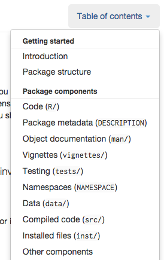

The Benefits and Ease of Writing R Packages
========================================================
Kristen Sauby

Ph.D. Candidate

Department of Biology

University of Florida

Presentation to Gainesville R User Group

6 October 2015

Reasons to Use Packages
========================================================

- Organize functions
- Systematic method to keep notes and documentation with each function
  - information on all arguments
  - example code - make sure your function is working as expected
- example
  - ?sum

Why did I start writing my own packages?
========================================================

- started during Spring 2015
- I'm a quantitative ecologist broadly interested in food web ecology
- Restricted Adaptive Cluster Sampling
  - in collaboration with Mary C. Christman, Ph.D.
  - statistical sampling project in which the sampling methods and estimators are not already available in R
- data processing functions used across multiple data analysis projects
  - e.g., a function to replace "999", "Not Recorded", "not recorded", "na" with "NA"

Restricted Adaptive Cluster Sampling
========================================================
- sorry - the package isn't ready for the public, yet!
- but I'll give you a peak

<div align="center">

</div>

Statistical Sampling Project
========================================================
How can we sample the species within a food web efficiently by maximizing the number of samples in which the species of interest are present?

- Adaptive Cluster Sampling (ACS) versus Restricted Adaptive Cluster Sampling (RACS)
- SRSWOR: Simple Random Sampling Without Replacement
<div align="center">

</div>

Restricted Adaptive Cluster Sampling
========================================================
Data example: Cactus plants and insect in northeastern Florida

<div align="center">

</div> 

Restricted Adaptive Cluster Sampling
========================================================
-Methods-

- 100 bootstraps per realization and per primary sample size (n=10, 30, 70, 100)
  - note - we will be doing many more bootstraps soon!
<div align="center">

</div>

Restricted Adaptive Cluster Sampling
========================================================
-Results-
Bias is influenced by estimator choice.
<div align="center">

</div>


Statistical Sampling Project
========================================================
-Results-
Bias of the variance estimator is very low for RACS.
<div align="center">

</div>

Data Processing Functions
========================================================
Let's go to Github and look at some function examples

https://github.com/ksauby/dataproc/blob/master/R/NA_Function.R

Let's Write Our Own Package
========================================================

Hadley Wickham's *R Packages* Book
- Almost everything I learned about creating an R package I found here

http://r-pkgs.had.co.nz/

Let's Write Our Own Package
========================================================

In RStudio:

File -> New Project -> New Directory -> R Package

Open and edit DESCRIPTION

Let's Write Our Own Package
========================================================

In RStudio:

- Open R folder
	- Let's write our first function
	- if you don't have already have a function in mind, write (and modify, if you'd like) the NA_Function found here: https://github.com/ksauby/dataproc/blob/master/R/NA_Function.R
		- add an example using @example


Let's Write Our Own Package
========================================================

In RStudio:

- load the package:


```r
devtools::document()
```

- now, look up your function:


```r
?NA_Function
```

Let's Write Our Own Package
========================================================

In RStudio:

- install the package:


```r
devtools::install()
```

- now load your package:


```r
library(example1)
```

Package Structure
========================================================

- We've just skimmed the surface of package structure so far



(Also the table of contents for Wickham's *R Packages* book!)

Object Documentation
========================================================
- In my opinion, this is one of the big payoffs of storing your functions in a package
- Ideally, you will be able to leave you function for weeks or months, come back to it, and still *understand how your function works*

Data
========================================================
- loads automatically when you load your package


Thanks for coming!
========================================================
Feel free to contact me!

Kristen Sauby, ksauby@ufl.edu

twitter: @KristenSauby
